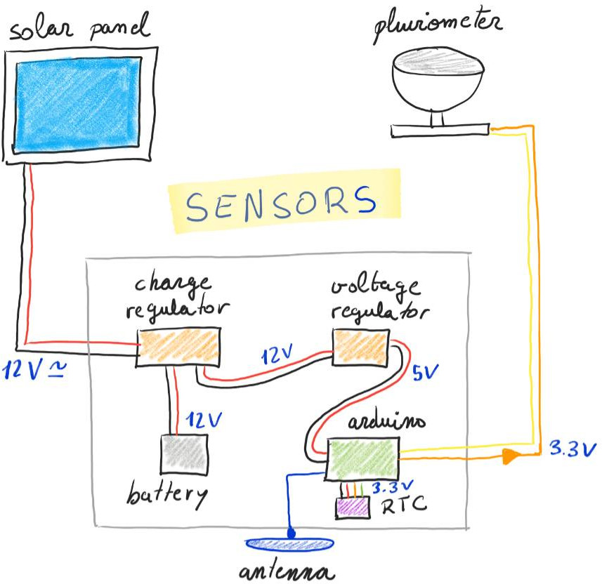

# Treboada project sensors

The Treboada project...

This sketch uses interrupts to read pulses from 2 sensors (equipped with reed switches).
The board enters sleep mode when not reading a sensor or sending data.
Sleep modes allow a significant drop in the power usage of a board while it does nothing waiting for an event to happen. 
Battery powered application can take advantage of these modes to enhance battery life significantly.
In this sketch, the internal RTC will wake up the processor every 10 minutes. Absolute  time is kept using an DS3231 RTC.
When the processor is woken up, it sends the data collected during 10 minutes to SigFox.

>Please **NOTE** that, if the processor is sleeping, a new sketch can't be uploaded. To overcome this, manually reset the board (usually with a single or double tap to the RESET button). On the Arduino MKR Fox 1200 you have to press the reset button for a couple of second, release and press it briefly. An orange led should light